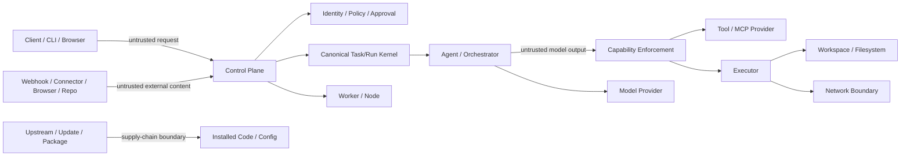

# Platform Security Threat Model

Status: normative baseline for issue #43. This document is intentionally living and must be extended as security-sensitive subsystems land.

## 1. Purpose and scope

The platform coordinates agents, models, tools, executors, files, external systems and potentially multiple machines. A core assumption is that natural-language content, model output, retrieved content, tool output and external events may be malicious or compromised even when they originate from an otherwise legitimate task.

The threat model therefore separates **intent** from **authority**. Models may propose actions, but only canonical identity, policy, approval and enforcement paths may authorize them.

This baseline covers the current foundation and defines required hooks for future workers, plugins, browser/network access, connectors, imports/exports, registries and update systems. Those later components extend this model; they are not prerequisites for establishing it.

## 2. Security objectives

The platform should preserve:

- confidentiality of user/project/workspace data and credentials;
- integrity of canonical Task, Run, Approval, Event, Agent, configuration and provenance state;
- confinement of execution to authorized capabilities, workspaces and network scopes;
- isolation between users, projects, workspaces, providers, workers and sessions;
- availability against accidental or malicious resource exhaustion within configured limits;
- auditability of security-critical decisions and side effects;
- recoverability after worker loss, compromise, replay, crash or update failure;
- replaceability of adapters without weakening canonical security ownership.

## 3. Protected assets

Protected assets include at minimum:

| Asset | Primary risks |
| --- | --- |
| User, project and workspace data | disclosure, modification, cross-project access |
| Source code and files | traversal, overwrite, exfiltration, malicious modification |
| Secrets and credentials | logging, prompt leakage, provider leakage, theft, replay |
| Canonical database/state/events | tampering, forged transitions, rollback, replay |
| Task/Run/Approval integrity | forged authority, mismatched approval, duplicate execution |
| Agent/AgentTeam definitions | capability escalation, model/prompt tampering |
| Model/tool configuration | provider redirection, unsafe capability expansion |
| Worker/node access | impersonation, unauthorized dispatch, secret theft |
| Artifacts/results/provenance | tampering, malicious payloads, false provenance |
| Administrative privileges | escalation, session theft, confused deputy behavior |
| Plugins/extensions | supply-chain compromise, permission escalation |
| Connector/browser/repository sessions | token/cookie leakage, session confusion, external side effects |
| Backup/update/import packages | tampering, rollback, malicious payloads, secret inclusion |

## 4. Actors and attacker capabilities

Relevant actors include:

- authenticated users with legitimate but limited access;
- platform administrators;
- service identities and workers;
- model providers and local/self-hosted models;
- tool/MCP/capability providers;
- adapters/plugins;
- external connector services and webhook senders;
- upstream package/repository maintainers;
- unauthenticated network clients where an endpoint is exposed;
- an attacker controlling task text, files, retrieved knowledge, webpage content, tool output or downloaded artifacts;
- a compromised worker, plugin, provider, model endpoint, connector, dependency or upstream release.

Assume an attacker may attempt prompt injection, schema abuse, path traversal, symlink escape, replay, forged metadata, identity confusion, SSRF, credential exfiltration, excessive resource use and supply-chain substitution.

## 5. Canonical security invariants

These rules are binding baseline architecture requirements:

1. **Model and Agent output is untrusted input to privileged systems.**
2. **Authority comes from canonical identity, policy and approval decisions, never from an LLM request or natural-language claim.**
3. **Sensitive operations pass canonical backend enforcement points and cannot be authorized only in the frontend.**
4. **Canonical workspace/file boundaries cannot be bypassed through provider-private paths.**
5. **Plaintext secrets are excluded from normal canonical serialization, logs, events, traces, diagnostics and exports.**
6. **Backend, plugin, provider, node or worker identifiers do not confer authorization.**
7. **External content, retrieved knowledge and webpage/tool output cannot silently elevate permissions.**
8. **Optional adapters/plugins are not trusted merely because they are installed.**
9. **Single-node operation uses the same security ownership model as distributed mode.**
10. **Security-critical actions remain auditable through canonical actor/resource/action context.**

If an implementation appears to require violating one of these invariants, the work must stop for explicit architecture/security review and an ADR where the architecture materially changes.

## 6. Trust boundaries

The initial trust boundaries are:

1. client/browser/CLI -> Control Plane;
2. authenticated actor -> authorization/policy boundary;
3. user/task/external content -> Agent/model context;
4. model output -> canonical capability/tool invocation;
5. capability/tool provider -> Executor or external side effect;
6. Executor -> workspace/filesystem/network/host resources;
7. platform core -> adapter/plugin implementation;
8. Control Plane -> local or remote Worker;
9. platform -> model provider;
10. platform -> MCP/tool provider;
11. external webhook/event -> Automation;
12. connector/browser/repository content -> Agent/task context;
13. upstream/update/package -> installed platform code/configuration;
14. backup/import/export package -> canonical platform state/files.

### Structured data-flow view

No arrow in this diagram implies authorization. Each privileged transition must still satisfy the relevant canonical policy and enforcement decision.

## 7. External entry points

Current or future entry points include:

- Control Plane HTTP/API requests;
- CLI and web-client requests through canonical APIs;
- task goals, prompts and uploaded files;
- model responses;
- MCP/tool/provider responses;
- worker registration, dispatch callbacks and results;
- webhook and connector events;
- browser/retrieval/repository content;
- plugin manifests and plugin code;
- import packages, backup restores and registry packages;
- upstream dependency and platform updates;
- configuration/environment input.

All external entry points require schema/structural validation, bounded resource handling and explicit trust classification before privileged use.

## 8. Privileged actions

Examples of privileged actions include:

- filesystem read/write/delete outside ephemeral in-memory state;
- command/process execution;
- network access and browser navigation;
- sending messages or mutating external services;
- repository writes, commits, pushes or merges;
- reading or delivering secret material;
- changing identity, authorization, approval or policy state;
- registering or trusting a worker/plugin/provider;
- installing or updating code/packages;
- importing/restoring canonical state;
- administrative configuration changes;
- destructive task/run/workspace operations.

Sensitive actions should be deny-by-default unless a canonical policy explicitly allows them, and should require approval when policy or capability classification says approval is required.

## 9. Baseline controls

### 9.1 Canonical security context

Security-critical decisions should carry canonical actor, action, resource, project/workspace and correlation context. Provider-private metadata may be retained for diagnostics but must not grant authority.

The initial reusable type is `ai_multi_agent_platform.security.SecurityContext`.

### 9.2 Secure-default decisions

The baseline decision model is explicit `ALLOW`, `DENY` or `REQUIRE_APPROVAL`. `baseline_decision(...)` is deny-by-default and deliberately ignores adapter metadata. Issue #15 will supply the final authorization/approval engine while preserving these semantics.

### 9.3 Input validation

Untrusted inputs must be validated at the nearest canonical boundary. Schema validation remains required for endpoint/capability-specific contracts. The reusable `validate_untrusted_json(...)` helper provides baseline rejection of non-JSON objects, non-finite numbers and excessive nesting/item/string sizes.

### 9.4 Workspace and path confinement

Filesystem operations must:

- use platform-selected workspace roots;
- reject absolute paths where a relative path is required;
- reject parent traversal;
- normalize/resolve paths before access;
- reject symlink/junction-resolved escapes;
- avoid provider-private path bypasses;
- use least-privilege OS/container permissions for production execution;
- treat TOCTOU races as a production sandbox concern, not as solved solely by string/path validation.

`resolve_within(...)` is the reusable baseline helper. The existing ReferenceExecutor is regression-tested against traversal and symlink escape.

### 9.5 Secrets and redaction

Plaintext secret material must not be part of normal canonical objects. Use scoped secret references where possible. The initial `SecretReference` type contains locator/scope metadata but no plaintext secret value.

Before logs, traces, events, diagnostics or exports, sensitive mappings must pass reusable redaction. `redact_sensitive(...)` recursively redacts common password/token/key fields and serializes secret references without resolving them.

Issue #34 must integrate real secret storage/config resolution and expand classification/redaction coverage.

### 9.6 Network and SSRF hooks

Future network/browser/connector implementations must have a policy seam before performing outbound requests. At minimum support:

- allow/deny destination policy;
- scheme restrictions;
- DNS/IP re-checks where appropriate;
- blocking loopback, link-local, metadata-service and private ranges unless explicitly authorized;
- redirect validation;
- response/download size limits;
- timeout and concurrency limits;
- explicit classification of external side effects;
- cookie/session isolation per provider/user/project scope.

Issue #74 extends these requirements for browser/web content.

### 9.7 Replay and deduplication hooks

External/distributed messages must carry stable identities/idempotency keys where repeated delivery can cause side effects. Consumers must distinguish duplicate delivery from a new authorized action. Issue #35 owns transport semantics; #14/#36 extend worker identity and dispatch security; #44 extends webhook/connector verification.

### 9.8 Resource limits

Security-sensitive boundaries should expose time, size, concurrency and rate-limit hooks. Unbounded model/tool/executor/network payloads are not acceptable secure defaults.

### 9.9 Audit events

Security-critical actions should produce an audit/security event with canonical actor/action/resource context, decision, reason, correlation data and side-effect classification. Plaintext secrets must be excluded before persistence/telemetry.

The initial reusable `SecurityAuditEvent` defines this minimal shape. A later observability subsystem may transport it but must not redefine authority semantics.

### 9.10 Supply-chain provenance

Dependencies, vendored/forked/ported source and architecture-significant upstreams must follow `LICENSE_POLICY.md`, `docs/UPSTREAMS.md`, the adoption checklist and update workflow. Security review must also consider integrity, pinning, source provenance, permissions and update rollback.

## 10. Threat categories and abuse cases

### Prompt and tool abuse

**Threats**

- prompt injection attempts to trigger unauthorized tools;
- retrieved/web/tool content asks the agent to override system policy;
- an Agent fabricates approval or identity claims;
- malicious model/tool output influences a later privileged operation;
- an attacker hides instructions in files or retrieved knowledge.

**Required mitigations**

- treat all model/external content as data, not authority;
- authorize the concrete canonical action after model planning;
- bind approval to the exact reviewed actor/resource/action/invocation;
- revalidate tool input at invocation time;
- do not infer permissions from free-form text or adapter metadata;
- keep sensitive capabilities deny-by-default.

**Residual risk**

A sufficiently capable model may still be manipulated into proposing harmful but apparently plausible actions. The protection is enforcement, least privilege and approvals, not model obedience alone.

### Execution and filesystem

**Threats**

- arbitrary command execution outside allowed capability;
- workspace traversal or symlink/junction escape;
- host filesystem leakage;
- environment variable and secret leakage;
- unsafe temporary files/artifacts;
- TOCTOU path races;
- resource exhaustion.

**Required mitigations**

- explicit capability allow-listing;
- workspace confinement and symlink-aware resolution;
- filtered environment/secret delivery;
- per-run time/resource limits;
- least-privilege process/container identity;
- production sandbox/container boundary where risk warrants it;
- artifacts treated as untrusted on later consumption.

### Network, browser and connectors

**Threats**

- SSRF into loopback/private networks/cloud metadata services;
- unauthorized outbound requests;
- malicious redirects/downloads/uploads;
- side effects triggered without approval;
- cookie/token/session confusion;
- webhook spoofing/replay;
- malicious webpage/connector content used as instructions.

**Required mitigations**

- outbound network policy hooks and destination validation;
- explicit side-effect classification;
- isolated sessions/cookies/tokens;
- signature/nonce/timestamp verification for webhooks where supported;
- replay/deduplication;
- download/content limits and safe artifact handling;
- external content remains untrusted after retrieval.

### Authentication and authorization

**Threats**

- privilege escalation;
- cross-project/resource access;
- service/worker impersonation;
- stale sessions after revocation;
- direct adapter calls bypassing canonical policy;
- approval replay against a different action.

**Required mitigations for #15/#36**

- canonical identity with revocation semantics;
- authorization at backend enforcement points;
- exact resource/action/project scope;
- no authorization by backend identifier;
- service and worker authentication distinct from user identity;
- immutable approval binding to the reviewed action/invocation;
- denial remains effective when optional adapters are absent.

### Secrets and data leakage

**Leak paths**

- logs/traces/errors;
- prompts/model requests;
- events/messages;
- exports/imports;
- artifacts;
- plugin/tool payloads;
- backups;
- diagnostics.

**Required mitigations**

- SecretReference rather than plaintext canonical storage;
- scoped secret delivery only to the authorized operation;
- centralized classification/redaction;
- avoid broad environment inheritance;
- retention/minimization rules for telemetry and artifacts;
- backups/exports require explicit secret policy.

### Plugins, dependencies and upstream supply chain

**Threats**

- malicious plugin code or manifest;
- dependency compromise;
- upstream drift or ownership change;
- tampered package/update;
- permission escalation through manifest changes;
- provenance/license changes.

**Required mitigations**

- plugin installation does not imply trust;
- declared/approved permissions are canonical and reviewable;
- pinned/verifiable dependencies and packages where feasible;
- provenance records and review dates;
- explicit update workflow and rollback;
- no silent upstream replacement of canonical contracts.

### Distributed workers

**Threats**

- worker/service impersonation;
- replayed dispatch;
- capability misrepresentation;
- compromised/lost worker;
- over-broad secret delivery;
- malicious/fabricated results.

**Required model for #14/#36**

- canonical worker/service identity;
- authenticated registration and dispatch;
- replay-resistant job semantics;
- explicit trust level/capabilities;
- least-privilege scoped secrets;
- revocation/quarantine for compromised workers;
- worker results treated according to trust/policy and validated before privileged reuse.

### Durable Plan/Step coordination

**Threats**

- an attacker forges an Event identity or correlation key to wake a Step belonging to another task, project or owner;
- a valid Approval is replayed against a different subject, action or Step wait;
- duplicate webhook/Event/Approval delivery causes repeated wakeups or duplicate canonical Runs;
- a stale or spoofed coordinator claim commits after another coordinator has taken ownership;
- an unauthorized caller invokes reconciliation, repair or cancellation as a way to force runtime progress;
- restart repair blindly recreates a missing Run and duplicates a canonical side effect;
- provider/webhook payloads, credentials or secrets leak into coordinator persistence or telemetry;
- a future external durable-workflow adapter is treated as an authority source rather than a replaceable runtime mechanism.

**Required mitigations for #384**

- durable waits bind to canonical Task/Plan/Step identity plus exact owner/project scope;
- Approval waits bind to the exact Approval ID, subject type, subject ID and action;
- Event waits require the expected canonical event type and correlation key and reject foreign scope;
- wakeups and Run observations use stable processed/idempotency keys so replay is a no-op;
- canonical Run creation/start uses deterministic kernel idempotency keys at crash boundaries;
- coordinator writes use optimistic revisions plus expiring claims and monotonically increasing fencing tokens;
- stale/expired claims cannot commit after takeover;
- reconciliation first delegates canonical Run/Worker recovery to the kernel and marks unresolved contradictions explicitly inconsistent instead of blindly dispatching;
- Control Plane repair/reconcile/cancel commands remain behind the canonical authorization and idempotency boundary;
- coordinator state stores only backend-neutral wait descriptors/references, policy/version, dedupe, dependency and reconciliation metadata, never raw provider/webhook payloads or secret material;
- coordination telemetry uses canonical references and redacted/safe attributes only;
- an optional future Temporal/DBOS/other engine adapter cannot redefine canonical identity, authorization, approval, Run/Event truth or security ownership.

**Residual risk**

A compromised process with direct write access to the coordinator SQLite store can still corrupt runtime metadata. Deployment filesystem/database permissions, backup integrity and later distributed-store hardening remain necessary. Contradictions that cannot be proven safe are intentionally surfaced as `INCONSISTENT` and require an authorized repair path rather than speculative execution.

## 11. Residual risks

The baseline does not claim to eliminate:

- kernel/OS/container escape vulnerabilities;
- compromised dependencies or compilers before stronger supply-chain verification exists;
- TOCTOU filesystem races in hostile multi-process environments;
- model-provider retention or misuse when a deployment intentionally sends data to an external provider;
- deployment-specific firewall/TLS/host-hardening failures;
- social engineering of humans granting approvals;
- unknown vulnerabilities in future plugins, browsers, connectors or imported packages.

High-risk deployments should use independent security review and penetration testing.

## 12. Assumptions

Current assumptions include:

- the host running the trusted Control Plane is not already fully compromised;
- canonical persistence is protected by deployment-level filesystem/database permissions;
- Python/runtime dependencies are obtained from intended sources;
- the ReferenceExecutor is a deterministic development/reference executor, not a complete hostile-code sandbox;
- later authentication/authorization, secret, worker and network subsystems will extend rather than bypass this baseline.

## 13. Re-evaluation triggers

Review this threat model when any of the following changes:

- new privileged capability or execution primitive;
- remote Worker/Node support;
- authentication, authorization or approval semantics;
- secret/config handling;
- transport/event bus or webhook ingestion;
- workspace/materialization behavior;
- plugin system or executable extension loading;
- browser/network access;
- connector/repository write access;
- import/export/backup package formats;
- package registry/distribution;
- update/release/upstream workflow;
- new persistence boundary or multi-tenant deployment model;
- discovered vulnerability, near miss or security regression.

## 14. Required downstream extensions

The following issues must revisit this document and add subsystem-specific tests/controls:

- #12 capability/tool invocation threats;
- #14 remote Worker/Node threats;
- #15 authorization/approval enforcement;
- #20 plugin isolation and supply chain;
- #34 secret/config handling;
- #35 transport/replay/message security;
- #36 authentication/session/service identity;
- #37 workspace/materialization isolation;
- #42 update/upstream integrity;
- #44 connectors/external events;
- #74 browser/network/web-content threats;
- #79 import/export package threats;
- #81 registry/distribution trust;
- #82 repository/Git side effects;
- #384 durable Plan/Step coordination, replay, repair and fencing threats;
- #46 end-to-end conformance of the accumulated security invariants.

Use [`SECURITY_EXTENSION_CHECKLIST.md`](SECURITY_EXTENSION_CHECKLIST.md) for every security-sensitive subsystem.

## 15. Initial regression ownership

`tests/test_security_baseline.py` establishes regression fixtures for currently implementable invariants:

- traversal and absolute-path rejection;
- symlink-resolved workspace/artifact escape;
- sensitive-value redaction;
- SecretReference non-plaintext serialization;
- malformed/non-finite/unbounded input rejection;
- deny-by-default decisions;
- adapter-private metadata cannot grant authority;
- optional adapter absence does not alter canonical security ownership.

Issue #384 extends the same regression baseline with coordinator-specific coverage for foreign-scope Event/wait resolution, exact Approval subject/action binding, duplicate/replayed wakeups, stale fencing tokens, conservative reconciliation and safe coordinator persistence/telemetry descriptors.

Future subsystem tests should extend this baseline rather than create separate, incompatible security rules.
