# Agent-Sandbox threat model (#798)

Review scope: `agent-sandbox/agent-sandbox` at
`d1b7ac007debcb1ba8de91c76afb49bee90d096a`  
Status: **static/design evidence only; live isolation claims remain unproven**

This document consolidates the trust boundaries and attack surface required by #798. It is not a
penetration-test report. Source-level findings are recorded in
`AGENT_SANDBOX_SECURITY_REVIEW.md`; live proof requirements are recorded in
`AGENT_SANDBOX_LIVE_EVIDENCE.md`.

## Security objective

Agent-Sandbox is being evaluated only as an optional execution provider behind platform-owned
contracts. The protected-profile objective is to contain untrusted or model-generated workloads so
that they cannot gain authority beyond the exact canonical execution request, Workspace scope,
network policy and scoped credentials already authorized by the platform.

The provider is not allowed to become an authorization authority, secret authority, Workspace
owner, Browser-domain owner, retry/completion authority or canonical identity source.

## Trust-boundary diagram

```mermaid
flowchart LR
    U[Agent / user-controlled input]
    P[Platform control plane\nTask / Run / Authorization / Policy]
    E[Canonical Executor boundary]
    A[AgentSandboxExecutor\nprovider-private adapter]
    API[Agent-Sandbox API / controller]
    K[Kubernetes API / node runtime]
    S[Sandbox workload\nuntrusted code / browser]
    W[Canonical Workspace / Artifact store]
    N[External / private / cluster networks]
    C[Scoped credential source]

    U -->|untrusted intent / tool arguments| P
    P -->|authorized canonical request| E
    E --> A
    A -->|provider request + provider credential| API
    API -->|lifecycle / Pod operations| K
    K -->|creates / controls| S
    P -->|authorized Workspace scope| W
    A <-->|materialize / collect only approved paths| W
    P -->|authorized scoped secret reference| C
    C -.->|future minimum-material delivery path; not implemented| S
    S -->|policy-mediated egress only| N
    S -->|Artifact candidates only| A
```

The important boundaries are:

1. **B1 — untrusted input -> platform control plane.** #15/#43 policy and Approval remain
   authoritative before provider dispatch.
2. **B2 — platform -> provider API.** Provider credentials and sandbox IDs are implementation
   details; a provider request must not gain authority absent from the canonical request.
3. **B3 — provider controller -> Kubernetes/runtime.** Controller compromise has substantial
   namespace-local impact because the reviewed Role includes lifecycle and `pods/exec` powers.
4. **B4 — Kubernetes/runtime -> sandbox workload.** Pod security context, runtime class, service
   account, mounts, cgroups and namespace configuration define the actual workload isolation
   boundary and require live proof.
5. **B5 — sandbox -> network.** Protected workloads require effective deny-by-default egress with
   explicit scoped allows; provider configuration is enforcement projection, not policy authority.
6. **B6 — sandbox -> Workspace/Artifact boundary.** Only the authorized Workspace may be
   materialized and only validated relative Artifact paths may return to canonical storage.
7. **B7 — secret source -> sandbox.** No production secret-delivery path is accepted yet. Direct
   `ExecutionRequest.environment` projection fails closed in the PoC because the reviewed upstream
   EnvVar path can serialize values into ReplicaSet annotation data.

## Assets that require protection

| Asset | Canonical owner | Threat if provider boundary fails |
|---|---|---|
| Task/Run/Step/correlation identity | platform | provider identity becomes canonical or cross-run evidence is confused |
| Authorization/Approval state | platform | untrusted workload gains operations not approved by #15 |
| Security/egress policy | platform | data exfiltration, SSRF or internal service reachability |
| Workspace contents | platform | unrelated host/platform data disclosure or unauthorized writes |
| Artifacts/evidence | platform | path escape, forged provenance or unsafe provider metadata persistence |
| Provider API credentials | deployment/#34 | sandbox lifecycle/control-plane compromise |
| Workload-scoped credentials | #34 | enumeration, persistence or exfiltration beyond intended task |
| Kubernetes credentials/control plane | cluster operator | namespace or broader cluster compromise |
| Image/template provenance | deployment profile | mutable or attacker-controlled execution environment |
| Browser session state | canonical #74 boundary | cookies/downloads/screenshots leak across sessions or bypass policy |

## Threat actors and assumptions

The evaluation assumes that sandbox workload input can be fully malicious. This includes
model-generated shell commands, hostile repositories, dependency install scripts and browser
content. A sandbox must not rely on workload cooperation for cleanup or policy enforcement.

The platform control plane, canonical policy decision, canonical Workspace/Artifact stores and
host/cluster administration are trusted for this evaluation. Provider code and the Kubernetes
control plane are privileged infrastructure components rather than untrusted workloads; compromise
of either is therefore treated as a blast-radius question, not as something the sandbox itself is
expected to contain.

Sandbox identifiers are **not** treated as authorization secrets. Any profile claiming tenant
separation must remain safe when another tenant knows a sandbox ID.

## Attack surface

| Surface | Why it matters | Current evidence | Required mitigation / live proof |
|---|---|---|---|
| Agent-Sandbox HTTP/E2B-compatible API | lifecycle and sandbox access | source reviewed | platform-mediated access, rotated scoped provider credentials, ownership tests |
| ID-addressed get/delete/snapshot/lifecycle routes | possible object-ownership gap | AS-SEC-009 source concern | cross-token tests for every relevant operation |
| Controller ServiceAccount / Kubernetes API | high namespace-local privilege | AS-SEC-002 | dedicated namespace, least privilege, cross-namespace denial evidence |
| `pods/exec` capability | controller can execute in sandbox Pods | source reviewed | isolate controller/API from workloads and unrelated platform services |
| Sandbox Pod runtime | executes hostile code | default blueprint insufficiently hardened | explicit security context, runtime-class and malicious-workload tests |
| ServiceAccount token mount | exposes cluster credential to hostile code | AS-SEC-004 | `automountServiceAccountToken: false` and live unreadability/API-denial proof |
| ReplicaSet annotations / provider metadata | can retain request data | AS-SEC-005 | no direct secret EnvVars; synthetic canary scan across retained evidence |
| Network policy/enforcement | exfiltration and SSRF | upstream allow-by-default documented | IPv4/IPv6/DNS/redirect/private/link-local/cluster bypass matrix |
| Workspace materialization | host/platform data exposure | canonical path validation in PoC only | exact-scope upload/mount plus outside read/write attempts |
| Artifact collection | path escape / evidence confusion | returned path validation in PoC | real download/collection round trip and provenance evidence |
| Image/template selection | supply-chain and runtime downgrade | AS-SEC-006/007 | platform allowlist, digest pinning, effective image/runtime verification |
| Snapshot/pause/resume APIs | stale state, secret persistence, identity leakage | source capability only | stale/incompatible snapshot, process/filesystem and cleanup tests |
| Browser/desktop/VNC surface | privileged parallel tool path or session leakage | capability advertised only | #74-mediated lifecycle and session/download/screenshot isolation tests |
| External/network storage | durability can enlarge data exposure | provider FS documented ephemeral | explicit Workspace ownership, retention and cleanup policy before use |

## Blast-radius model

### Sandbox workload compromise

A successful protected profile should confine a compromised workload to its assigned sandbox,
authorized Workspace material and explicitly allowed network/credential scope. It must not expose
host runtime sockets, ambient Kubernetes credentials, another sandbox, provider control-plane
credentials or unrelated canonical data.

This target is **not yet proven**. The live campaign must exercise host paths, Kubernetes metadata,
peer sandboxes, internal services, egress bypasses and malicious repositories.

### Agent-Sandbox controller compromise

The reviewed controller Role is namespace-scoped rather than cluster-wide, which limits the source-
visible default blast radius. It is nevertheless broad inside that namespace and includes Pod
lifecycle and exec operations. The evaluation therefore requires a dedicated namespace containing
no unrelated platform workloads, reduced RBAC where practical, and explicit tests showing that the
controller cannot operate on unrelated namespaces.

### Kubernetes node/runtime compromise

A container/runtime escape can exceed the guarantees of provider-level sandbox APIs. Stronger
runtime classes such as gVisor or Kata are therefore deployment-profile candidates rather than
assumed guarantees. Each claimed protected profile requires its own compatibility and bypass
evidence. #798 will not describe ordinary Kubernetes scheduling as equivalent to a strong isolation
boundary.

## Network boundary

The reviewed upstream configuration permits Internet access by default. That posture is rejected
for the protected platform profile.

The platform policy layer remains authoritative and a provider integration may only project an
already-authorized egress decision. The PoC therefore defaults `allow_internet_access` to false.
Adoption evidence must still demonstrate effective enforcement for:

- IPv4 and IPv6;
- DNS resolution and DNS-based rebinding/alternate-address cases where applicable;
- redirects;
- loopback;
- RFC1918/private ranges;
- link-local and cloud metadata targets;
- Kubernetes/cluster-service and provider control-plane targets;
- direct socket access and alternate ports/protocols;
- one explicitly allowed destination while all non-allowed destinations remain blocked.

A connection failure is not by itself proof of policy enforcement; the retained campaign must show
that the intended enforcement layer is present and that bypass fixtures fail.

## Secret boundary

No supported protected-profile secret injection exists in the current PoC.

The reviewed upstream EnvVar path is specifically excluded because sandbox environment values can
be serialized into ReplicaSet `sandbox-data` annotation material. A future accepted path must:

1. deliver only task-scoped minimum secret material authorized through #34;
2. avoid copying plaintext values into provider metadata, Kubernetes annotations, logs, events or
   canonical evidence;
3. make provider/Kubernetes ambient credentials unavailable to workload code;
4. support revocation/cleanup at sandbox termination;
5. retain only synthetic/redacted evidence during validation;
6. combine with egress policy so credential possession does not imply unrestricted exfiltration.

Until such a path is proven, secret-bearing Agent-Sandbox execution is unsupported by the protected
profile.

## Provider authentication and tenant separation

The provider API must be reachable through a platform-controlled mediation boundary rather than
being treated as a tenant-facing canonical API. Provider credentials belong to deployment/#34 and
must not be exposed to agents or sandbox workloads.

The source-level AS-SEC-009 finding means tenant separation cannot be inferred from successful token
authentication alone. The live campaign must create independently authenticated sandboxes and
attempt cross-token get, connect/router, snapshot, pause/resume, inspect and delete operations with
a known foreign sandbox ID. A profile may claim shared-provider multi-tenancy only if every
operation that reveals or mutates the foreign sandbox is rejected.

A deployment that instead isolates tenants at a stronger service/namespace boundary must record
that topology explicitly; it still cannot treat provider object IDs as canonical authorization.

## Image and template provenance

Protected execution profiles must be deployment-owned. Agent/model input must not select arbitrary
runtime classes, privileged templates or mutable execution images.

The accepted profile must retain the configured image reference and runtime-reported image digest,
pin or otherwise prove immutable image provenance, record the provider revision, and keep the
runtime class on an allowlist controlled outside model input. Provider-native template IDs remain
namespaced metadata.

## Browser/computer-use ownership resolution

#74 remains the **sole canonical Browser/Web capability owner**. Agent-Sandbox browser, desktop or
VNC functionality, if eventually used, is only a provider-side execution mechanism behind that
boundary. It must not create a second agent-facing Browser schema, privileged tool API, download
store, screenshot identity or independent network/credential policy.

Accordingly:

- canonical browser requests and capability authorization originate through #74;
- Agent-Sandbox-specific session identifiers remain adapter metadata;
- downloads return through canonical File/Artifact ownership;
- screenshots/evidence use canonical evidence paths;
- browser egress and credentials obey the same #34/#43 decisions as shell execution;
- direct provider Browser/VNC access is not a supported agent-facing path;
- browser capability remains **unsupported for the Agent-Sandbox profile** until the live #74
  round-trip, session-isolation and download/screenshot evidence succeeds.

This resolves ownership without claiming that the advertised provider feature has passed the
required integration test.

## Residual risks even after a passing protected profile

A passing live campaign would reduce risk; it would not make arbitrary code execution risk-free.
Residual risks include:

- vulnerabilities in Agent-Sandbox, Kubernetes, the container runtime or stronger runtime class;
- controller compromise within its accepted namespace privilege;
- malicious behavior using destinations or credentials that policy intentionally allowed;
- supply-chain compromise of an otherwise approved image or dependency;
- denial of service within configured CPU/memory/disk/process quotas;
- browser engine vulnerabilities and malicious web content;
- stale data retained by external/network storage or provider snapshots if those capabilities are
  enabled;
- policy mistakes in the platform-to-provider projection layer.

These risks require patching, profile versioning, observability and least-privilege operations even
if #798 ultimately recommends a supported optional provider.

## Decision impact

The static threat model supports only **continue evaluation**. It does not support `adopt` or
`optional_provider_only` by itself. A final outcome still requires the representative live campaign
and head-to-head operational/resource evidence defined by #798.
